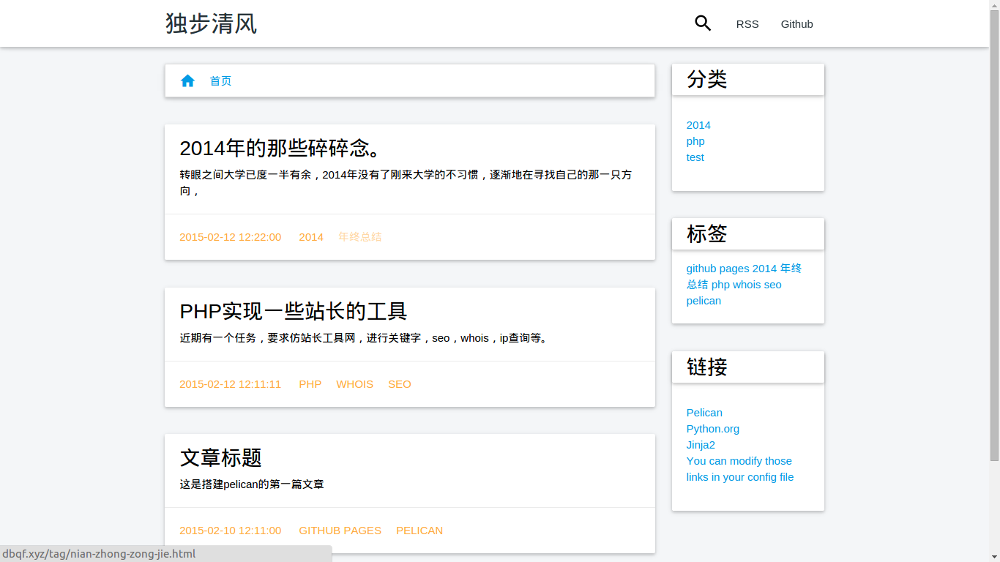

# Dubuqingfeng #

基于materialize的一种pelican主题。

##Example 示例地址：

[独步清风's blog](http://dbqf.xyz)

## Screenshot 截图 ##



## 配置 ##

pelicanconf.py

```
THEME = 'pelican-themes/这个主题名字'
DEFAULT_DATE_FORMAT = '%Y-%m-%d %H:%M:%S'
DISQUS_SITENAME = u"dubuqingfeng"
GITHUB_USER = u"dubuqingfeng"
```